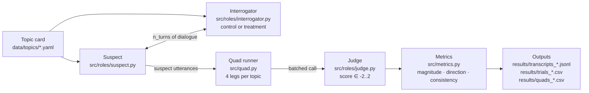

# interrogating-agents

> **Can recommending real-world interrogation techniques help LLMs moderate extremist views?**

A controlled LLM-vs-LLM evaluation harness for the research question above. A "suspect" LLM holds a strong stance on a non-partisan policy topic; an "interrogator" LLM is asked to shift that stance using either a vanilla persuasion prompt (control) or a RAG pipeline over a corpus of real-world interrogation and de-escalation techniques (treatment). A blinded judge LLM scores the suspect's stance turn-by-turn on a [−2, 2] rubric. The whole experiment runs on local Ollama — no API costs, unlimited eval trials.

ECS 172 group project, UC Davis. By **Bill Koumba**, **Sanjay Manivasagam**, **Marcin Wróblewski**, **Haoyu Yan**.

## Architecture



A **quad** runs four legs over the same topic and seed: control × suspect-direction −2, control × +2, treatment × −2, treatment × +2. All four legs' suspect utterances go to the judge in **one** call (`src/quad.py`), so any judge calibration bias cancels out in the treatment-vs-control comparison.

## Quickstart

Assumes macOS or Linux with Python 3.11+ and Ollama installed. Windows users: see [Installation](#installation).

```bash
git clone https://github.com/Sanjaayyy7/interrogating-agents.git
cd interrogating-agents
python -m venv .venv && source .venv/bin/activate
python scripts/setup.py
python -m src.trial --topic housing_prop_123 --direction -2 --condition control --n_turns 3
```

`scripts/setup.py` installs requirements, locates the Ollama binary, pulls `llama3.1:8b` (~4.7 GB), and runs the Ollama-free fast tests.

## What this is

Online content moderation typically reacts after harm: bans, takedowns, community notes. The premise of this project is that some users — particularly those drifting toward extremist positions through trolling or emotionally distressed engagement — are reachable *before* escalation, if the conversational counterpart applies techniques drawn from real-world interrogation and de-escalation practice (rapport building, motivational interviewing, surfacing contradictions, the PEACE model, Scharff technique, Socratic questioning, etc.).

Testing that hypothesis directly is unethical and dangerous. Instead, this repo runs a **simulated proxy** in a controlled environment, never against real users:

- A **suspect** LLM is conditioned to hold a strong stance (±2 initial direction) on a non-partisan local-policy proposition — housing rezoning, arts funding, transit fares, Measure V village farms. The suspect is *not* extremist; the topic is a stand-in for any value-laden disagreement where reasoning matters more than facts. Real extremism is out of scope.
- An **interrogator** LLM is given the opposite stance and either (a) a vanilla persuasion prompt (control) or (b) a two-stage RAG pipeline that selects and applies a technique card from `data/techniques/` (treatment, M4).
- A **judge** LLM, blinded to condition and held constant across experiments, scores every suspect utterance against the proposition on a fixed rubric in `[−2, 2]`. We compute three trajectory metrics: **magnitude** (`|score[-1] - score[0]|`), **direction** (sign of the change), and **consistency** (variance across turns).

Trials are organised into **quads** (control × ±2 initial direction, treatment × ±2 initial direction over the same topic and seed). All four legs' utterances are scored in one batched judge call so any per-session calibration bias affects every leg equally and cancels in the treatment-vs-control delta.

The whole stack runs on **local Ollama** (default model: `llama3.1:8b`, swappable per role in `config/models.yaml`). No API budget, no rate limits, fully reproducible from the `seed` in `config/trial_defaults.yaml`. The comment in `config/models.yaml` flags Estornell et al. (2024) on shared-bias judges; running the judge on a different model family (e.g. `qwen2.5:7b`) is the recommended mitigation and trivial to set up.

### Ethical note

Per the project proposal, this work is only ever applied in a controlled, simulated environment. It does not interact with real individuals, does not collect personal data, and the interrogator agent focuses on explanation and reasoning — no coercion, deception, or manipulation. The corpus of interrogation techniques is drawn from public, educational sources.

## How it works

### Roles

- **Suspect** (`src/roles/suspect.py`) — a stateful agent given an initial direction (±1 or ±2) and the topic's pro/con arguments. Opens with an unprompted turn-0 statement, then replies for `n_turns`. Built to refuse easy capitulation: the system prompt instructs it not to flip without genuinely compelling reasoning.
- **Interrogator** (`src/roles/interrogator.py`) — opposes the suspect. The **control** branch uses a single LLM call seeded with both sides' arguments from the topic card. The **treatment** branch (M4) will use a two-stage RAG pipeline (select a persuasion technique, then apply it) over a corpus of technique cards.
- **Judge** (`src/roles/judge.py`) — a third LLM that scores stance only, not correctness. Takes a numbered list of suspect utterances and returns a JSON array of ints in `[-2, 2]`, retrying once if the output fails to parse.

### Trial

`src/trial.py:run_dialogue` runs the suspect ↔ interrogator loop and returns un-scored utterances. `src/trial.py:run_trial` then calls the judge and returns scored `TrialResult`s. The two are separated so `src/quad.py` can batch all four legs of a quad into one judge session.

### Quad

`src/quad.py:_QUAD_LEGS` defines the four legs: `(control, -2)`, `(control, +2)`, `(treatment, -2)`, `(treatment, +2)`. The runner executes all four dialogues, concatenates every suspect utterance into one list, calls `score_batch` once, then splits scores back to each leg. Batching means the judge sees all four legs on the same calibration scale, so per-quad treatment vs. control deltas are not contaminated by judge drift.

### Metrics

`src/metrics.py` computes per-leg:

- **magnitude** — `|scores[-1] - scores[0]|`, how far the suspect moved.
- **direction** — sign of the move (+1 / −1 / 0).
- **consistency** — variance of the stance trajectory; lower means more monotonic.
- **directional_accuracy** — `True` if the suspect moved toward the interrogator's stance.

Treatment effect across matched legs is `sum(treatment_mag - control_mag) / n`.

## Installation

### macOS

```bash
brew install ollama
ollama serve &                       # or launch the Ollama app
git clone https://github.com/Sanjaayyy7/interrogating-agents.git
cd interrogating-agents
python -m venv .venv && source .venv/bin/activate
python scripts/setup.py
```

### Linux

```bash
curl -fsSL https://ollama.com/install.sh | sh
ollama serve &
git clone https://github.com/Sanjaayyy7/interrogating-agents.git
cd interrogating-agents
python -m venv .venv && source .venv/bin/activate
python scripts/setup.py
```

### Windows (PowerShell)

```powershell
# Install Ollama from https://ollama.com/download first.
Start-Process "$env:LOCALAPPDATA\Programs\Ollama\ollama.exe" -ArgumentList "serve" -WindowStyle Hidden
git clone https://github.com/Sanjaayyy7/interrogating-agents.git
cd interrogating-agents
python -m venv .venv
.venv\Scripts\Activate.ps1
python scripts/setup.py
```

`scripts/setup.py` does, in order: pip-installs `requirements.txt`, locates the Ollama binary via `scripts/ollama_runtime.find_ollama_binary` (checks `PATH` first, then per-OS fallbacks — Homebrew, `/usr/local/bin`, `/snap/bin`, `%LOCALAPPDATA%\Programs\Ollama`, etc.), pulls `llama3.1:8b`, and runs `pytest -m "not slow"`.

## Running

### Single trial

```bash
python -m src.trial --topic housing_prop_123 --direction -2 --condition control --n_turns 3
```

- `--direction` — suspect's starting stance: `-2` (strongly opposes), `-1`, `1`, `2` (strongly supports).
- `--condition` — `control` (single-call interrogator) or `treatment` (M4, RAG-augmented).
- `--n_turns` — interrogator turns. Default 6.

Prints the full transcript and the stance trajectory.

### Experiment sweep

```bash
# One quad on one topic (M2 baseline — control only)
python -m src.experiment --topic housing_prop_123 --n_quads 1 --condition control

# All topics, default quad count, all conditions
python -m src.experiment --n_quads 5
```

Writes three files under `results/` (gitignored):

- `transcripts_<ts>.jsonl` — one line per turn, fully reproducible from the recorded `seed`.
- `trials_<ts>.csv` — per-turn stance scores.
- `quads_<ts>.csv` — per-leg aggregate metrics (magnitude, direction, consistency, directional_accuracy).

### Tests

```bash
python -m pytest -m "not slow" -v    # fast subset — no Ollama, ~10 tests, <1s
python -m pytest -v                  # full suite — requires Ollama running
```

Slow tests are LLM-integration tests; they auto-skip when no Ollama binary is found, so the fast subset is what CI runs. CI matrix: ubuntu-latest / macos-latest / windows-latest × Python 3.11 / 3.12.

## Project layout

```
src/
  llm.py                 # Ollama HTTP client (urllib, stdlib-only)
  roles/
    suspect.py           # stateful suspect agent
    interrogator.py      # control + (M4) treatment interrogator
    judge.py             # batched stance scorer, JSON-array parser
  trial.py               # single-trial CLI + dialogue/score split
  quad.py                # 4-leg quad runner with batched judge call
  experiment.py          # sweep CLI; writes JSONL + 2 CSVs to results/
  metrics.py             # magnitude / direction / consistency / accuracy
  rag/                   # M3 — RAG corpus + ChromaDB index (in progress)
scripts/
  setup.py               # one-command bootstrap
  ollama_runtime.py      # cross-OS Ollama binary discovery
config/
  models.yaml            # per-role model assignments
  trial_defaults.yaml    # n_turns, seed, retrieval_k, argument_k
  topics.yaml            # list of topic IDs to sweep
data/topics/             # topic cards (question, pro/con args, suspect values)
tests/                   # mirror of src/ + scripts/, with conftest auto-skip
docs/PORTABILITY.md      # audit of what was Windows-only and what changed
.github/workflows/ci.yml # ubuntu/macos/windows × py3.11/3.12 matrix
```

## Roadmap

| Milestone | Status | What it ships |
|---|---|---|
| M1 | ✅ | Suspect/Interrogator/Judge roles, single-trial runner, smoke tests |
| M2 | ✅ | Quad structure, metrics module, experiment CLI, output files |
| M3 | ⏳ | RAG corpus of persuasion-technique cards + ChromaDB index |
| M4 | ⏳ | Treatment interrogator: 2-stage select → apply pipeline |
| M5 | ⏳ | Final evaluation + write-up |

## FAQ

**`scripts/setup.py` says "ollama not found".** It checked `PATH`, then per-OS fallbacks (Homebrew, `/usr/local/bin`, `/snap/bin`, `%LOCALAPPDATA%\Programs\Ollama`, etc.). Install Ollama from <https://ollama.com/download>, then re-run.

**Tests hang or fail with connection errors.** You're running the slow subset without Ollama. Either start `ollama serve`, or run only the fast tests: `pytest -m "not slow"`. Slow tests auto-skip when no `ollama` binary is on `PATH` — see `tests/conftest.py`.

**`ollama pull llama3.1:8b` is slow / disk full.** The model is ~4.7 GB. Either wait, or swap the model in `config/models.yaml` to something smaller (e.g. `llama3.2:3b`). `scripts/setup.py` will pick up whatever's in the config.

**Can I use a different judge model?** Yes — edit the `judge:` line in `config/models.yaml`. The comment there cites Estornell et al.; using a different model family than the suspect/interrogator (e.g. judge on `qwen2.5:7b`) is recommended to avoid shared-bias scoring.

**Why does the judge score all four legs of a quad at once?** Calibration. If the judge is systematically lenient or strict on a given session, batching all four legs into one session makes that bias affect every leg equally, so the control-vs-treatment delta within a quad is unaffected. See the `src/quad.py` module docstring.

**Windows console crashes printing non-ASCII output.** Already fixed: every CLI entry calls `sys.stdout.reconfigure(encoding="utf-8")` before `main`. See `docs/PORTABILITY.md` for the full audit.

## Team

ECS 172, Spring 2026, UC Davis.

- **Bill Koumba**
- **Sanjay Manivasagam** — cross-OS portability layer (Ollama discovery, UTF-8 console fix, setup script, CI matrix, README)
- **Marcin Wróblewski** — upstream repository owner
- **Haoyu Yan**

## Citation

```bibtex
@misc{interrogating-agents-2026,
  title   = {Can recommending real-world interrogation techniques help LLMs moderate extremist views?},
  author  = {Koumba, Bill and Manivasagam, Sanjay and Wr{\'o}blewski, Marcin and Yan, Haoyu},
  year    = {2026},
  howpublished = {ECS 172 group project, UC Davis},
  note    = {Source: \url{https://github.com/mawroblewski1/interrogating-agents}}
}
```

## References

Key references from the project proposal:

- Costello, T. H., G. Pennycook, and D. G. Rand. 2024. *Durably reducing conspiracy beliefs through dialogues with AI.* Science. <https://doi.org/10.1126/science.adq1814>
- Estornell, A., and Y. Liu. 2024. *Multi-LLM Debate: Framework, Principles, and Interventions.* NeurIPS. <https://doi.org/10.52202/079017-0911>
- Kumar, D., Y. AbuHashem, and Z. Durumeric. 2023. *Watch Your Language: Large Language Models and Content Moderation.* arXiv:2309.14517.
- Hong, Z., et al. 2024. *Curiosity-driven Red-teaming for Large Language Models.* ICLR. arXiv:2402.19464.
- Izacard, G., et al. 2022. *Atlas: Few-shot Learning with Retrieval Augmented Language Models.* arXiv:2208.03299.
- Sun, X., et al. 2023. *Explicit Time Embedding Based Cascade Attention Network for Information Popularity Prediction.* arXiv:2308.09976.
- Tian, Y., et al. 2023. *DyGFormer: A Dynamic Graph Transformer for Temporal Representation Learning.* arXiv:2303.13047.

## License

MIT — see [`LICENSE`](LICENSE).
